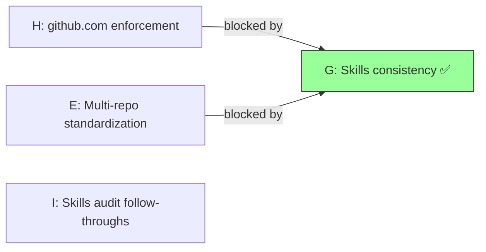

# Epic Dependency

You are about to surface — and optionally render — the cross-epic dependency graph for this repository. Native GitHub sub-issues handle intra-epic parent/child links; this skill handles the orthogonal dimension: **which epics block which other epics**.

The **source of truth** is the `## Dependencies` block in each epic's issue body. The rendered output in `docs/ROADMAP.md` §Epic dependencies is a **derived artifact** regenerated on every `map` invocation — do not hand-edit it.

When filing a new epic and declaring a dependency, hand off to `epic`, which prompts for `## Dependencies` during creation.

## Inputs

- **Op 1 (Map)**: no arguments. Scans all `epic`-labeled issues.
- **Op 2 (Validate)**: no arguments. Same scan; reports cycles and dangling references without rendering.
- **Required tools**: `gh` CLI authenticated to the repo; `git` for committing ROADMAP changes.

## Dependency block format

Each epic issue body may contain an optional `## Dependencies` section. The format is frozen:

```markdown
## Dependencies

- Blocked by #NN — one-line reason
- Blocked by #MM — one-line reason
```

Rules:

- Each line MUST match the pattern: `- Blocked by #<number> — <reason>` (em-dash `—`, not hyphen).
- `#<number>` MUST reference another `epic`-labeled issue. References to non-epic issues are flagged as warnings and skipped.
- Self-dependencies (`#N` blocked by `#N`) are flagged as errors.
- Duplicate edges (same blocker listed twice) are deduplicated with a warning.
- If the `## Dependencies` section is absent or contains only `_None._`, the epic has no cross-epic blockers.

## Steps

### Op 1 — Map

Scan, build, render, commit.

#### Step 1: Scan epic issues

```bash
gh issue list --label epic --state all --limit 200 \
  --json number,title,state,body
```

Parse each issue's `## Dependencies` section. Build an edge list:

```
edges = [
  { from: <blocked_epic>, to: <blocking_epic>, reason: <text>, resolved: <bool> }
]
```

An edge is **resolved** when the blocking epic's state is `CLOSED`. An edge is **open** when the blocking epic is still `OPEN`.

#### Step 2: Validate

Run cycle detection (topological sort) on the directed graph of open edges only. If a cycle exists, **halt with error** — print the cycle path and refuse to render. The user must fix the cycle in the epic bodies before re-running.

Flag warnings (non-halting):

- Dangling references (blocker `#N` not found in the epic list).
- Self-dependencies.
- Duplicate edges.
- References to non-epic issues.

Print a validation summary:

```
Dependency graph: <N> epics, <M> edges (<K> open, <J> resolved)
Warnings: <list or "none">
Errors: <list or "none">
```

#### Step 3: Render to ROADMAP

Generate two artifacts inside `${CLAUDE_PROJECT_DIR}/docs/ROADMAP.md` under a `## Epic dependencies` heading (placed immediately after the `## Epics` block, before `## Where we are`):

**3a. Mermaid diagram:**



Conventions:
- Node label: `<epic-id>: <short title>` (title truncated to 40 chars).
- Shipped/closed epics get a `✅` suffix and the `shipped` CSS class.
- Edge label: `blocked by`.
- Sort nodes by epic issue number ascending for deterministic output.
- If no edges exist, emit `_No cross-epic dependencies declared._` instead of the diagram.

**3b. Tabular view:**

```markdown
| Epic | Blocked by | Status |
|---|---|---|
| #102 (E) | #123 (G) | ✅ resolved |
| #139 (H) | #123 (G) | ✅ resolved |
```

- Sort by blocking epic number ascending, then blocked epic number ascending.
- Status: `✅ resolved` if blocker is closed; `⏳ open` if blocker is still open.
- If no edges exist, omit the table.

#### Step 4: Commit

The rendered section is fenced with HTML comments for idempotent regeneration:

```markdown
<!-- epic-dependencies-start -->
… generated content …
<!-- epic-dependencies-end -->
```

On re-run, the skill replaces everything between these markers.

If the content changed from the previous render:

```bash
git add docs/ROADMAP.md
git commit -m "docs: regenerate epic dependency map"
```

If nothing changed, skip the commit and print `Epic dependency map is up to date.`

### Op 2 — Validate

Run Steps 1–2 of Op 1 only (scan + validate). Do **not** render or commit. Print the validation summary and the edge list. Useful as a pre-flight check before filing a new epic.

## Reference

- Outputs, success criteria, restartable semantics, scope boundary, and cross-references: [`reference.md`](${CLAUDE_SKILL_DIR}/reference.md)
